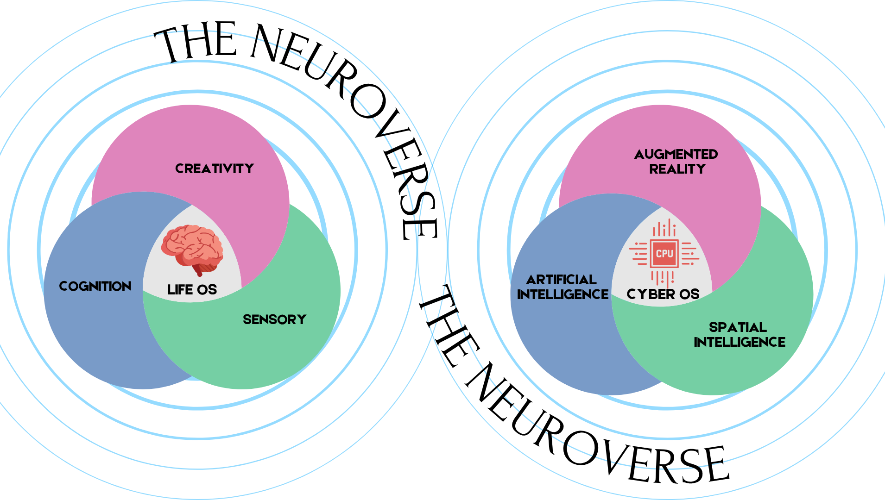
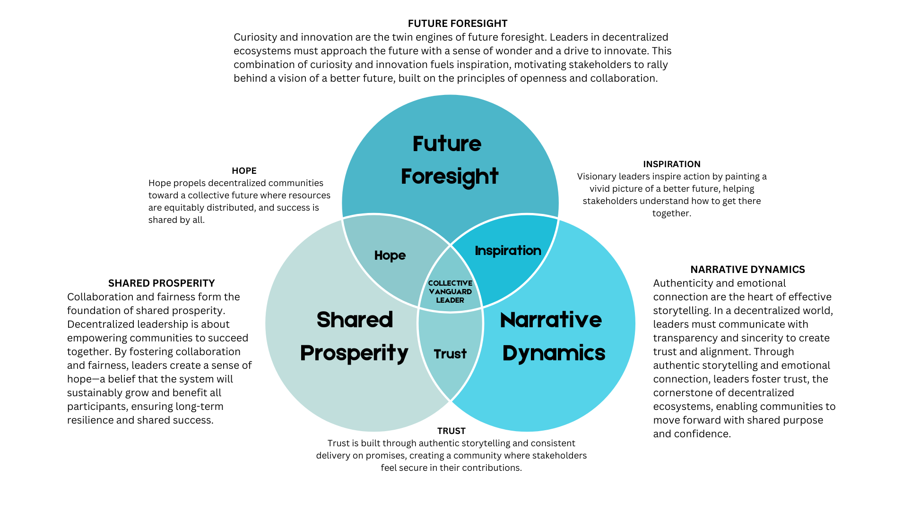
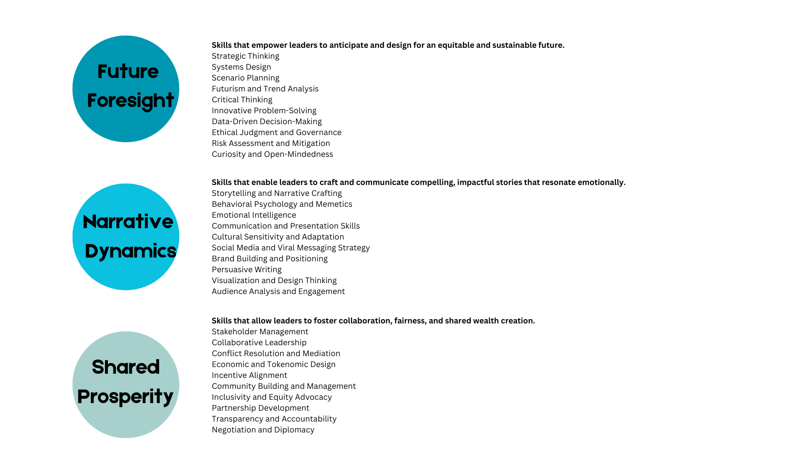

# Radiant — behavioral alignment for the ExoCortex

## What the ExoCortex already does brilliantly

The ExoCortex gives every AI on the team persistent context. It learns about your business. It shares what it learned with colleagues. Contributors can point at your repos, ask "how can I help?" and get real answers. You're already testing the future of decentralized AI coordination — building in public, asking each other's exocortex what people are working on, what they're struggling with, how to help.

That's working. That's real. Don't change any of it.

## The one thing it doesn't do

The ExoCortex gives AI memory. But it doesn't tell AI what that memory **means** — relative to what Auki actually stands for.

When an AI learns from your Swedish retail customer on his morning commute, what governs what it absorbs? When a contributor asks "how can I help?" and the exocortex answers, what ensures the answer reflects Auki's actual priorities — cognitive liberty, decentralization, perception-first, protocol-not-product — and not just whatever's in the latest commit?

The ExoCortex remembers. But who makes sure the memory stays aligned with the mission?

## What Radiant adds

Radiant is the alignment layer. It doesn't replace the ExoCortex — it reads the ExoCortex alongside the activity and tells you whether the work matches what you said you'd do.

Two different intelligences are working together at Auki every day — human intelligence and artificial intelligence. Each has its own strengths. Each operates differently. Neither is a lesser version of the other.

<p align="center">
  
</p>

NeuroverseOS is the universe these two intelligences meet inside — defined by the behaviors Auki has agreed upon: the vision, the strategy, the non-negotiables. All organizations gather people around declared shared intent. NeuroverseOS tools define those intentions into behaviors — and those behaviors become a constitution carried out at runtime.

## Built for Auki specifically

Radiant ships with two worldmodels authored for Auki:

**Auki Vanguard** — the leadership model. Three domains that define how Auki leads: the skills needed for strategic thinking and systems design, the skills needed for authentic storytelling and community building, the skills needed for collaboration, fairness, and shared wealth creation. When these three work together, trust, inspiration, and hope emerge. When all three integrate fully, the team operates as a collective vanguard leader.

<p align="center">
  
  &nbsp;
  
</p>

**Auki Strategy** — the goals and required behaviors. Posemesh, Sixth Protocol, cognitive liberty, DePIN, Intercognitive coalition. The invariants: cognitive liberty preserved, decentralization before aggregation, perception before locomotion, protocol not product, sovereignty over convenience.

These worldmodels aren't generic templates. They were authored from Auki's actual strategy documents, glossary, blog posts, and the Intercognitive Foundation thesis. When Radiant reads your team's activity, it reads it through THIS frame — your frame.

## What you get immediately (zero install)

A `CLAUDE.md` file goes into the org repo. Every Auki employee's exocortex picks it up on their next `git pull` — because the org repo is already symlinked into every personal exocortex.

After that: every Claude Code session across the entire team starts with Auki's invariants, vocabulary, voice rules, and decision priorities loaded. Nobody installs anything. Nobody changes a workflow. The AI just starts thinking in Auki's frame.

Try this: ask Claude *"I want to centralize the spatial data for easier queries."*

Without Radiant's governance frame, Claude helps you build it.

With the governance frame, Claude pushes back — cites `sovereignty_over_convenience` and `decentralization_before_aggregation`, calls centralization "the failure mode, not a neutral choice," and proposes a Posemesh-native alternative using domains, DHT, and the discovery service.

Same Claude. Same model. Different frame. The CLAUDE.md is the difference.

## What you get with the behavioral dashboard

Point Radiant at any repo and get a read on what's actually happening — measured against what Auki said it would do:

```bash
npx @neuroverseos/governance radiant emergent aukilabs/exocortex \
  --lens auki-builder --worlds ./worlds/ --exocortex ~/exocortex/
```

Real output from your exocortex repo (52 events, 14-day window):

```
EMERGENT

  template_system_emergence
    The exocortex template is becoming infrastructure that others use
    to bootstrap their own thinking systems. Multiple people are
    onboarding through the same structural pattern, suggesting this
    could scale beyond the core team.

  execution_ahead_of_strategy
    High shipping velocity on infrastructure and templates, but strategic
    direction setting lags behind. You're building the means without
    declaring the ends clearly.

MEANING

  The team is shipping infrastructure at high velocity — templates,
  onboarding systems, project structure — but the strategic story
  connecting these pieces hasn't crystallized yet.

MOVE

  Declare what the integrated system is for before building more pieces.
  Force someone to own cross-module coordination.

ALIGNMENT

  Human work:                36 · concerning
  AI work:                   not enough signal to call yet
  Human–AI collaboration:    39 · concerning
  Composite:                 37 · concerning
```

Every pattern is grounded in real events from the repo. The MEANING section says what it means in plain language. The MOVE section says what to do — or honestly says "nothing's broken, keep shipping" when the read is healthy.

## The three alignment scores

- **Human work (L)** — is human activity aligned with what Auki declared? Not "are people productive" — "are they working inside the frame?"
- **AI work (C)** — is AI output aligned with the worldmodel? Right vocabulary? Invariants respected? Or generic, ungoverned output?
- **Human–AI collaboration (N)** — when human and AI work together, is shared meaning preserved? This score only exists because the worldmodel provides a shared frame to measure against.

## What's pushing against the alignment

The scores tell you where you are. The governance audit trail tells you **what's testing the frame** — and whether it's humans or AI doing the testing.

Every event Radiant reads gets evaluated against the worldmodel's invariants. When something pushes against one — a commit that skips a consent check, a PR that introduces centralization, an AI output that uses the wrong vocabulary — it gets recorded: which invariant, which side (human or AI), how many times.

The GOVERNANCE section of each read shows:

```
GOVERNANCE

  52 events evaluated.

  Human side:
    49 ALLOW · 2 MODIFY · 1 BLOCK
    BLOCK: commit touched spatial observation pipeline
           without consent check → sovereignty_over_convenience

  AI side:
    3 voice violations caught in AI output (all corrected)

  Balance: human side tested the frame 3 times.
  AI side tested the frame 3 times. Roughly balanced.
```

But the real value isn't one week's report — it's what happens **when the same thing keeps pushing.**

## When the team keeps pushing against the same invariant

If three engineers independently ask about centralizing spatial data in the same month, the invariant catches it every time. Good. But Radiant tracks this persistence across reads and surfaces the harder question:

> *"decentralization_before_aggregation has triggered 8 times across 3 reads. Always on the human side. The team keeps pushing against this invariant. Either the team needs alignment on WHY decentralization matters — or the team is telling you something the worldmodel hasn't absorbed yet."*

Three possible responses:

1. **The model is right, the team needs alignment.** People don't understand why decentralization matters. Training needed. Don't change the invariant.
2. **The team is right, the model needs updating.** There's a legitimate use case the invariant is too blunt to accommodate. Refine it.
3. **Both are partly right.** The invariant holds for custody but the team needs a centralized index. Add nuance to the worldmodel.

Radiant doesn't decide which. It surfaces the question and shows the evidence. The leader decides. The worldmodel evolves — or the team aligns. Either way, the cocoon adapts because the system told you where the pressure was.

## It works the other direction too

When an invariant **stops** firing — hasn't been tested in weeks — Radiant surfaces that as well:

> *"perception_before_locomotion hasn't triggered in 12 reads. Either the team has internalized it (the rule is redundant) or no one has done locomotion-adjacent work (the rule hasn't been tested). Review whether it still earns its place."*

A worldmodel that only grows eventually governs nothing. Radiant proposes what to add (persistent patterns) AND what to remove (silent invariants). Lean and sharp beats comprehensive and ignored.

## How it connects to the ExoCortex

Radiant reads the ExoCortex as **stated intent** — what people say they're focused on (attention.md, goals.md, sprint.md). It reads GitHub as **observed behavior** — what people actually did. The gap between those two is drift.

No other tool measures this. GitHub alone doesn't know what you said you'd do. The ExoCortex alone doesn't know what you actually did. Radiant reads both and tells you where they match and where they don't.

You said *"not AI governance, but AI coordination."* Radiant is the piece that makes coordination **aligned** — so when the AI learns about your business, and shares what it learned, and answers contributor questions, and helps your Swedish customer capture his retail knowledge on his morning commute — it does all of that inside the behavioral frame Auki declared, not outside it.

## The cocoon

Together, the ExoCortex and Radiant put you in a cocoon of behavior. Not a cage — a cocoon. Something you grow inside. Something that holds your shape while you're becoming what you said you'd become. The worldmodel defines the cocoon. The ExoCortex carries the memory. Radiant tells you whether you're growing inside it or pushing through it.

And when you push through — that's evolution, not violation. The cocoon adapts. The worldmodel updates. New shape, same principle.

## What's in this PR

```
governance/
├── CLAUDE.md              Governance frame (loaded by Claude Code at session start)
├── README.md              This file
├── worldmodels/
│   ├── auki-vanguard.worldmodel.md    Culture / leadership model
│   └── auki-strategy.worldmodel.md    Strategy / goals + required behaviors
└── images/
    ├── neuroverse-two-gyroscopes.png  The NeuroVerse model
    ├── auki-vanguard-diagram.png      Vanguard three-domain diagram
    └── auki-vanguard-skills.png       Vanguard skills breakdown
```

Once merged, every Auki employee's exocortex picks up the governance frame on their next `git pull`. No install. No config. It just shows up.

For the behavioral dashboard and MCP server: `npm install @neuroverseos/governance` — published at npm, runs on your machine, nothing hosted by us.

## Full documentation

- [Radiant for Auki — full README](https://github.com/NeuroverseOS/Neuroverseos-governance/blob/main/src/radiant/examples/auki/README.md)
- [Radiant PROJECT-PLAN — architecture, math, build order](https://github.com/NeuroverseOS/Neuroverseos-governance/blob/main/src/radiant/PROJECT-PLAN.md)
- [@neuroverseos/governance on npm](https://www.npmjs.com/package/@neuroverseos/governance)
